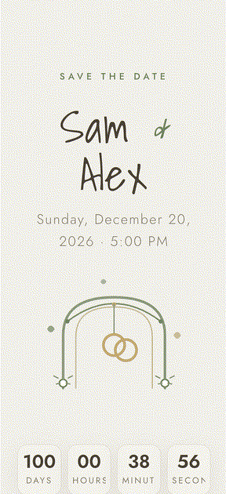
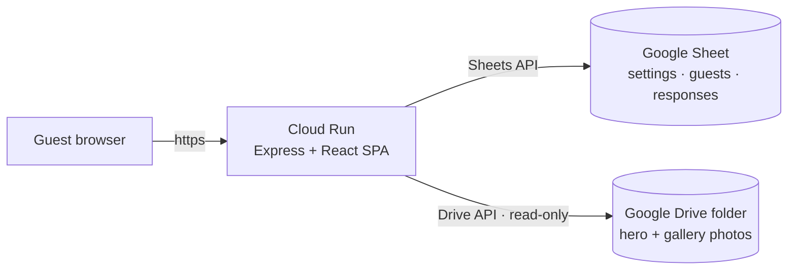

# 💍 Wedding Invite

An open-source wedding invitation website: personalized guest pages, RSVPs
written straight into **Google Sheets**, and a photo gallery served from a
**Google Drive folder**. TypeScript + React + styled-components on the front
end, a small Express API on the back end, deployable to **Cloud Run** with one
command.

MIT licensed — take it, personalize it, host it for anyone.

## Features

- **Runs with zero setup** — without any configuration the site starts in
  *demo mode* with built-in sample data and placeholder art, so you can
  preview everything before touching Google Cloud.
- **Public landing page** — couple names, animated countdown to the wedding,
  date/time, location, gift registry link.
- **Personalized guest page** (`/invite/<token>`) — greets the guest by name
  and shows their personal RSVP form.
- **RSVP form** — attending yes/no, +1 name (only for guests allowed a +1),
  separate dietary restrictions for guest and +1, song request, message.
  Every response is tagged with the guest's token, so you always know who
  said what.
- **Google Sheets as DB** — guests, settings and responses live in one sheet
  you create and own; updating the wedding date or venue does **not** require
  a redeploy.
- **Photos from Google Drive** — drop photos into a Drive folder you own and
  the site shows them. The folder is shared *read-only* with the service
  account and photos are streamed through the server, so they are never made
  public.
- **Add to calendar** — the "When" card downloads an `.ics` file guests can
  import into any calendar app (timezone-aware when `wedding_timezone` is set).
- **English / Spanish** — the language is a *site setting* from the sheet;
  visitors never get a toggle.
- **Minimal dependencies** — 6 runtime packages total (see below).

## ⚡ Try it in 60 seconds (demo mode)

No Google account, no cloud project, no configuration:

```bash
npm install
npm run dev:server   # Express API on :8080 — boots into demo mode
```

```bash
npm run dev:client   # Vite dev server on :5173, proxies /api to :8080
```

Open <http://localhost:5173>. Sample guest links to try:

- `/invite/demo` — a guest with a +1
- `/invite/demo-solo` — a guest without a +1

RSVPs in demo mode are kept in memory and reset on restart. The README below
explains how to connect a real sheet.

## 📸 Screenshots

Captured in demo mode (built-in sample data). Each preview is a fixed-size
phone frame that slowly auto-scrolls through the full page.

**Landing page**



**Invite page**


## Architecture



The service authenticates as a dedicated **service account** that has
**no IAM roles** — access is granted by sharing your sheet and folder with
its email address. Nothing else on your Google account is touched.

### Tech stack & dependency policy

This project intentionally keeps external dependencies to a minimum.

**Runtime (shipped in the Docker image — 6 packages):**

| Package | Purpose |
|---|---|
| `react` + `react-dom` | The SPA |
| `styled-components` | All styling, theming and animations |
| `express` | The small API server |
| `@googleapis/sheets` | Google Sheets access (brings `google-auth-library`) |
| `@googleapis/drive` | Reads the photos Drive folder (read-only) |

**Dev-only** (never in the Docker image): `typescript`, `vite`,
`@vitejs/plugin-react`, `babel-plugin-styled-components`, `tsx`, `vitest`, `@types/*`.

## Prerequisites

- **Node.js ≥ 22.12** (`.nvmrc` pins 22) and npm
- **Google Cloud account** with a project (billing enabled) — only for the
  hosted version; demo mode needs nothing
- **`gcloud` CLI** installed and authenticated (`gcloud auth login`)
- A personal **Google account** (Drive) for the sheet and the photos folder

---

## 🚀 Setup (real data)

The whole flow has three moving pieces you create *yourself* in the Google UI:
a **spreadsheet**, a **service account** in your GCP project, and (optionally)
a **Drive folder** with photos. Sharing them with the service account email is
what connects the site to your data.

### 0. Create the GCP project (skip if you already have one)

```bash
gcloud auth login
gcloud projects create YOUR_PROJECT_ID   # pick a globally unique ID
gcloud config set project YOUR_PROJECT_ID
gcloud billing accounts list             # find your billing account ID
gcloud billing projects link YOUR_PROJECT_ID --billing-account=XXXXXX-XXXXXX-XXXXXX
```

Billing must be enabled for the setup script to enable Cloud Run and the
other APIs.

### 1. Install

```bash
npm install
```

### 2. Google Cloud setup (one time)

```bash
bash scripts/gcp-setup.sh            # or: npm run gcp:setup
```

This enables Cloud Run, Google Sheets API, Google Drive API, Cloud Build and
Artifact Registry, creates the service account
`wedding-invite@<PROJECT>.iam.gserviceaccount.com` and an Artifact Registry
repository, grants Cloud Build permission to deploy to Cloud Run, then prints
next steps.

The script is idempotent — safe to re-run. On a freshly created project, IAM
permission propagation can lag a few seconds, so the script retries the Cloud
Build service-account grant automatically instead of asking you to run it
twice.

**Which GCP project does it use?** The script never prompts. It resolves the
project in this order:

1. The first CLI argument, e.g. `bash scripts/gcp-setup.sh my-project-id`
2. Your active `gcloud` configuration (`gcloud config get-value project`)
3. If neither exists, it prints its usage and exits.

So before running it, make sure your CLI is ready:

```bash
gcloud auth login
# optional — sets what the script will use when called without arguments:
gcloud config set project <PROJECT_ID>
```

The script echoes `==> Project: <name>` at the very start, so you can verify
what it picked. To also download a local key file for development in the same
run: `bash scripts/gcp-setup.sh --with-local-key`

### 3. Create the Google Sheet — *you* own it

1. In Google Sheets, create a new blank spreadsheet
   (File → New → Spreadsheet). You own it — there's no template to copy.
2. Copy the sheet's ID from its URL
   (`https://docs.google.com/spreadsheets/d/<THIS_IS_THE_ID>/edit`).
3. Put the ID in `.env` (step 4): `GOOGLE_SPREADSHEET_ID=<THIS_IS_THE_ID>`.

The tabs, headers and fields come next — `npm run sheet:setup` (step 5)
builds them for you.

### 4. Configure `.env`

```bash
cp .env.example .env
```

Then fill in:

```dotenv
# Local API port (Vite proxies /api to it). Cloud Run sets PORT itself.
PORT=8080

GOOGLE_SPREADSHEET_ID=<the ID from step 3>

# Optional — photos gallery (see next step):
GOOGLE_DRIVE_FOLDER_ID=<your Drive folder ID>

# Local-only service account key for the API server. If set, the step-5
# maintenance scripts also run as this account (ADC gives the key precedence) —
# leave it unset when you want them to run as yourself.
GOOGLE_APPLICATION_CREDENTIALS=/absolute/path/to/service-account-key.json

# Used by the link export script. Set this AFTER your first deploy (step 9) —
# the Cloud Run URL doesn't exist until then.
BASE_URL=https://your-service-abc-uc.a.run.app
```

To create the key file:

```bash
gcloud iam service-accounts keys create service-account-key.json \
  --iam-account=wedding-invite@<PROJECT>.iam.gserviceaccount.com
```

The file is gitignored — never commit it.

### 5. Share the sheet and initialize it

Open the sheet and share it with the service account email (printed by
`gcp-setup.sh`) as **Editor**. This is what gives the site read/write access —
no IAM role needed (see [Permissions](#-permissions-and-authentication)).

Then initialize the tabs and fields. This script runs as *your* Google
account (as long as `GOOGLE_APPLICATION_CREDENTIALS` is unset — ADC gives
that key precedence), so every edit stays under your ownership:

```bash
gcloud auth application-default login   # authenticate scripts as yourself
npm run sheet:setup
```

It creates the three tabs (`settings`, `guests`, `responses`), their headers,
the settings template and two example guest rows. It's safe to re-run — tabs
that already have data are left untouched.

### 6. Set up the photo gallery (optional)

1. In Google Drive, create a folder for the site's photos.
2. Upload your photos there. Name one image `hero.png` / `hero.jpg` (it is
   shown under the couple names — a transparent PNG works best); any other
   images become the gallery, sorted by file name.
3. Share the **folder** (not individual files) with the service account email
   as **Viewer**.
4. Copy the folder ID from its URL
   (`https://drive.google.com/drive/folders/<THIS_IS_THE_ID>`) and put it in
   `.env` as `GOOGLE_DRIVE_FOLDER_ID`.

Upload web-sized images (≤ 1600 px on the long edge is plenty) — the server
streams files as-is, it does not resize them. See
[Photos from Google Drive](#-photos-from-google-drive) for details.

### 7. Run locally (two terminals)

```bash
npm run dev:server   # Express API on :8080 (uses the SA key from .env)
```

```bash
npm run dev:client   # Vite dev server on :5173, proxies /api to :8080
```

Open <http://localhost:5173>.

### 8. Fill in the sheet

- **settings tab** — set names, wedding date/time, venue, gift registry URL
  and `site_language` (`en` or `es`).
- **guests tab** — replace the example rows with your guests. Leave the
  `token` column empty for now.

### 9. Deploy to Cloud Run

#### Manual deploy

```bash
gcloud builds submit --config=cloudbuild.yaml \
  --substitutions=_SHEET_ID=<YOUR_SPREADSHEET_ID>,_DRIVE_FOLDER_ID=<YOUR_DRIVE_FOLDER_ID>
```

When it finishes, note the service URL it prints
(`https://wedding-invite-<hash>-<region>.a.run.app`). Open it in a browser —
the landing page shows your settings and `/invite/<token>` serves each guest.
Put that URL in `.env` as `BASE_URL` (step 4) before exporting links.

> Deploying with an empty `_SHEET_ID` starts the site in **demo mode** with
> built-in sample data. For your real data, always pass your spreadsheet ID.

#### Automatic deploys (Cloud Build + GitHub trigger)

1. Push this repo to GitHub and connect it: GCP Console → Cloud Build →
   **Triggers** → Create trigger → select your repository, branch `main`, and
   `cloudbuild.yaml` as the config.
2. In the trigger's substitution variables, set `_SHEET_ID` to your
   spreadsheet ID, and `_DRIVE_FOLDER_ID` to your photos folder ID if you
   have one (adjust `_REGION`, `_REPOSITORY`, `_SERVICE_NAME`, `_SA_NAME`
   only if you changed the defaults).
3. Every push to `main` now builds, pushes and deploys. The service runs as
   the service account and gets the IDs injected as environment variables.

### 10. Generate guest tokens and links

```bash
npm run sheet:tokens    # fills empty token cells with unguessable tokens
npm run links:export    # prints all links + writes guest-links.csv
```

Each guest gets a URL like `https://your-service-abc-uc.a.run.app/invite/<token>`.
Send one link per guest — the token is what identifies them.

> `links:export` reads `BASE_URL` from `.env`, so run it **after** the first
> deploy has given you the real service URL. Re-run it any time to refresh
> the links.

## 📊 Google Sheet layout

The site reads/writes three tabs. Column order matters — the API addresses
columns by position. The `sheet:setup` script (step 5) builds all of
this already in place.

### `settings` — site-wide configuration (key/value rows)

| key | example | notes |
|---|---|---|
| `couple_name_groom` | `Liam` | shown on both pages |
| `couple_name_bride` | `Emma` | |
| `wedding_date` | `2026-09-12` | `YYYY-MM-DD` |
| `wedding_time` | `17:00` | 24h, venue local time |
| `wedding_timezone` | `Europe/Madrid` | optional — IANA timezone for the "Add to calendar" `.ics`; empty = viewer's local time |
| `wedding_end_date` | `2026-09-13` | optional — when the party runs past midnight (only used with `wedding_end_time`) |
| `wedding_end_time` | `02:00` | optional — 24h, venue local time; empty = start + 10 hours |
| `venue_name` | `Hacienda Los Rosales` | |
| `venue_address` | `Calle Flores 123, Ciudad` | |
| `venue_maps_url` | `https://maps.app.goo.gl/…` | optional — shows an "Open in Google Maps" button |
| `dress_code` | `Semi-formal` | optional — shown as a details card on both pages when set |
| `gift_registry_url` | `https://…` | external link to the gift list |
| `contact_email` | `you@example.com` | optional — shown to guests who already responded |
| `contact_whatsapp` | `https://wa.me/15551234567` | optional — WhatsApp link shown to guests who already responded |
| `site_language` | `en` | `en` or `es` — **site-wide, visitors cannot change it** |
| `rsvp_deadline` | `2026-08-01` | optional, shown on the details cards |

Unknown/missing keys fall back to defaults in `server/src/settings.ts`.
Changes appear within ~30 seconds (settings cache TTL) — no redeploy.

### `guests` — one row per guest/invitation

| column | example | notes |
|---|---|---|
| `token` | `QWERTYuio-9_` | generated by `npm run sheet:tokens` — leave empty and the script fills it |
| `name` | `María García` | full name — stored with responses and used for links export |
| `allows_plus_one` | `TRUE` | `TRUE`/`FALSE` — controls whether +1 fields appear in the form |
| `plus_one_name` | `Carlos García` | optional, pre-filled hint |
| `status` | `invited` | the site flips this to `responded` automatically |
| `notes` | anything | free-form, ignored by the site |
| `display_name` | `María` | optional — shown in the greeting; falls back to `name` when empty |
| `plus_one_display_name` | `Carlos` | optional — shown in the greeting; falls back to `plus_one_name` when empty |

> If your sheet predates the display-name columns, add the headers
> automatically with: `node scripts/add-display-name-columns.mjs`

### `responses` — written automatically by the site

`timestamp`, `token`, `guest_name`, `attending` (`yes`/`no`), `plus_one_name`,
`dietary_guest`, `dietary_plus_one`, `song_request`, `comments`,
`bringing_plus_one` (`yes`/`no` — whether the guest is actually bringing their +1).

Every row is appended by the API; nothing ever deletes or rewrites history.

## 🖼 Photos from Google Drive

- The site lists every image in the configured folder. A file whose name
  starts with `hero.` becomes the hero image; everything else is the gallery,
  sorted naturally by file name (`photo 10` after `photo 2`).
- The folder is shared **read-only** (Viewer) with the service account, and
  the server streams the files through `/api/photos/:id` — the browser never
  talks to Drive and the photos are never public.
- The file list is cached for 5 minutes, so newly added photos appear within
  a few minutes without a redeploy. Image bytes carry ETags for browser
  revalidation.
- Upload web-ready files (≤ 1600 px long edge). The server does not resize.

## 🔐 Permissions and authentication

### How the site authenticates to Google

The site uses **Application Default Credentials** (ADC) — one code path, two
modes:

| Where | How it authenticates | Key file? |
|---|---|---|
| **Local dev** | `GOOGLE_APPLICATION_CREDENTIALS` env var → downloaded service-account JSON key | yes, local file (gitignored) |
| **Cloud Run (prod)** | the service *runs as* the service account → automatic credentials from the metadata server | **no — fully keyless** |
| **Demo mode** | no Google access at all — built-in sample data | no |

### IAM roles: none needed

The service account needs **no IAM role on the GCP project**:

- **Sheets access** is granted by sharing the spreadsheet with the service
  account email as **Editor** (Sheet → Share → paste the SA email → Editor).
- **Drive access** is granted by sharing the photos folder with the service
  account email as **Viewer** — read-only.

The only project-level requirements are enabling the APIs (the setup script
does this) and Cloud Run being allowed to *run as* the service account — the
deploy step (`gcloud run deploy --service-account=…`) handles that
automatically.

## 🎨 Customization guide

Designed so someone can take this project and make it theirs.

- **Colors, fonts, spacing** → `client/src/theme.ts`. Every component consumes
  the theme.
- **All texts** → `client/src/i18n/en.ts` (source of truth) and `es.ts`.
  A unit test + the TypeScript types fail the build if keys drift.
- **Add a language** → add the dictionary, add it to `DICTIONARIES` in
  `client/src/i18n/LanguageContext.tsx`, extend the `Language` union in
  `shared/src/types.ts` and the check in `server/src/settings.ts`.
- **Wedding content** (names, date, venue, registry) → the
  `settings` tab — no code, no deploy.
- **Photos** → your Google Drive folder (see
  [Photos from Google Drive](#-photos-from-google-drive)). No commit, no
  rebuild — the site shows whatever is in the folder.
- **New sections** → compose `Card`, `Button` and the `Typography` primitives
  in `client/src/components/sections/`, then add them to
  `client/src/pages/LandingPage.tsx` / `InvitePage.tsx`.

## Testing

```bash
npm run typecheck   # all workspaces (builds shared first)
npm run test        # vitest unit tests
npm run build       # shared + server + client production builds
```

The tests cover: i18n key parity between English and Spanish, RSVP payload
validation/sanitization, guest-token rules, the photo endpoints and demo
mode. You can verify the runtime dependency footprint with
`npm ls --omit=dev` (should show only the 6 runtime packages).

## Scripts reference

| Command | What it does | Runs as |
|---|---|---|
| `npm run gcp:setup` | enable APIs, create SA + Artifact Registry repo (never prompts — see setup step 2) | your `gcloud` login |
| `npm run sheet:setup` | initializes your existing sheet with the 3 tabs, headers and the settings template | your Google account (ADC) |
| `npm run sheet:tokens` | fills empty guest tokens with random values | you or the SA |
| `npm run links:export` | prints + writes `guest-links.csv` | you or the SA |

## Environment variables

| Variable | Where | Required | Purpose |
|---|---|---|---|
| `GOOGLE_SPREADSHEET_ID` | `.env` / Cloud Run | for real data | the spreadsheet powering the site; unset = demo mode |
| `GOOGLE_DRIVE_FOLDER_ID` | `.env` / Cloud Run | no | Drive folder with the photos; empty = no gallery |
| `GOOGLE_APPLICATION_CREDENTIALS` | `.env` only | local only | path to the SA JSON key for local dev |
| `PORT` | `.env` / Cloud Run | no (default 8080) | server port; Cloud Run sets it itself |
| `BASE_URL` | `.env` only | scripts only | base URL used by `links:export` |

## Troubleshooting

- **Site shows sample data / placeholder art** — `GOOGLE_SPREADSHEET_ID` is
  not set, so the server is in **demo mode** (that's the fallback). Set the
  ID and restart.
- **"The caller does not have permission" / 403** — the sheet isn't shared
  with the right service account email (or a different project's SA). Re-share
  as Editor. Same for photos: the *folder* must be shared as Viewer.
- **API not enabled** — run `gcp-setup.sh` again (idempotent).
- **Guest link shows "Invitation not found"** — the token isn't in the
  `guests` tab (run `sheet:tokens`), or you edited the token by hand.
- **Language doesn't change after editing the sheet** — settings are cached
  for 30 seconds; refresh again.
- **Photos don't appear / just added one** — the photo list is cached for
  5 minutes; wait and refresh. The hero image must be named `hero.*`.
- **`/api/health` OK but pages fail** — `GOOGLE_SPREADSHEET_ID` missing/typo,
  or the sheet isn't shared yet.
- **Sheet created but you can't see it in Drive** — a script ran as the
  service account (you had `GOOGLE_APPLICATION_CREDENTIALS` set). Unset it,
  `gcloud auth application-default login`, and re-run `npm run sheet:setup`.

## 🚧 Out of scope *(decide later: implement or discard)*

These were deliberately left out. Revisit if needed:

- Photo gallery / itinerary sections beyond the carousel
- Admin UI for editing guests or reading responses (the sheet is the admin UI)
- Email / WhatsApp notifications when someone responds
- Guest-list management UI (scripts only)
- Visitor language toggle (language is a site setting by design)
- RSVP form on the public landing page (RSVP lives only on personalized views)

## 💭 Further considerations *(candidates: implement later or discard)*

- **Post-wedding state** — after `wedding_date`, show a "thanks for
  celebrating" message instead of the countdown and RSVP form.
- **RSVP deadline enforcement** — currently `rsvp_deadline` is informational;
  could block submissions after it.
- **Song list export** — a script that dedupes the `song_request` column into
  a playlist CSV for the DJ.
- **Per-guest language override** — currently site-wide only (a column in the
  `guests` tab could override `site_language` per guest).
- **Rate limiting** — a per-IP limiter on the RSVP endpoint for busier sites.
- **Caching beyond in-memory TTL** — fine at wedding scale (Sheets API quota:
  300 req/min); revisit only if traffic spikes.

## License

[MIT](LICENSE) © Benjamin Straub
